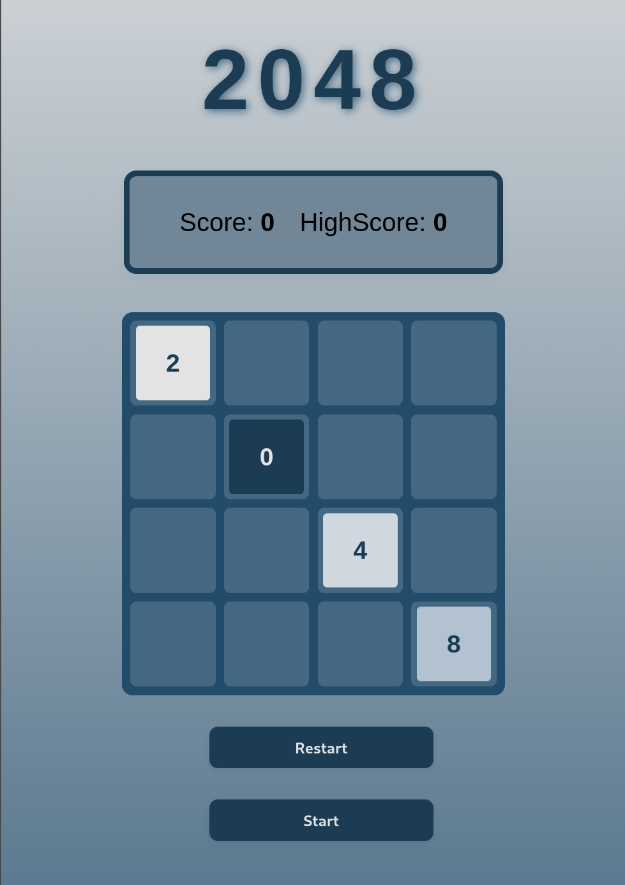

# 2048 🎮🚀

[`2048`] es un juego web clásico desarrollado con **HTML5, CSS3 y JavaScript vanilla**, containerizado con **Docker** y servido mediante **Nginx**.

El objetivo principal es implementar el popular **juego de puzzle 2048** con una interfaz responsive, mecánicas fluidas y un sistema de puntuación, proporcionando una experiencia educativa sobre desarrollo frontend, gestión de estado y animaciones web.

<br>


<br>


<br>




## Características principales ✨

- **Mecánica de juego completa**: movimiento de tiles, fusión, detección de victoria y derrota.
- **Sistema de puntuación dinámico**: score actual y high score persistentes.
- **Interfaz responsiva** adaptada a dispositivos móviles, tablets y desktop.
- **Animaciones suaves**: spawn de tiles, bump de puntuación y transiciones visuales.
- **Arquitectura modular**: separación clara entre lógica de juego, grid, tiles y puntuación.
- **Containerización con Docker**: entorno consistente y fácil de desplegar.
- **Servidor Nginx**: servicio de archivos estáticos optimizado.
- **Tema visual coherente**: paleta de colores oscuros con gradientes y sombras.

## Requisitos 📋

- **Docker** instalado en tu sistema (versión 20.10+).
- **Docker Compose** (generalmente viene incluido con Docker Desktop).
- **Make** (para comandos simplificados).
- Navegador moderno (Chrome, Firefox, Safari, Edge).
- **Alternativamente sin Docker**: servidor HTTP local (Python, Node.js, etc.) para desarrollo.

### Instalación de Docker

#### En Ubuntu/Debian:
```sh
sudo apt-get update
sudo apt-get install docker.io docker-compose
sudo usermod -aG docker $USER
# Reinicia sesión o ejecuta: newgrp docker
```

#### En macOS:
Descarga [Docker Desktop para Mac](https://www.docker.com/products/docker-desktop) e instálalo.

#### En Windows:
Descarga [Docker Desktop para Windows](https://www.docker.com/products/docker-desktop) e instálalo.

Verifica la instalación:
```sh
docker --version
docker-compose --version
```

## Compilar y ejecutar 🛠️

### Opción 1: Con Docker y Make (recomendado)

Comandos útiles del `Makefile`:

- `make up` — levanta el contenedor Nginx y sirve el juego en `http://localhost:8080`.
- `make down` — detiene el contenedor.
- `make logs` — muestra los logs en tiempo real.
- `make re` — reinicia todo (limpia y vuelve a levantar).
- `make fclean` — limpia volúmenes, imágenes y sistema Docker.

```sh
# Levantar el servidor
make up

# Ver logs
make logs

# Detener
make down
```

Luego accede a: **http://localhost:8080**

### Opción 2: Sin Docker (desarrollo local)

Sirve los archivos estáticos con cualquier servidor HTTP:

```sh
# Con Python 3
cd 2048/src
python3 -m http.server 8000

# Con Python 2
cd 2048/src
python -m SimpleHTTPServer 8000

# Con Node.js y http-server
npx http-server 2048/src -p 8000
```

Luego accede a: **http://localhost:8000**

## Estructura del proyecto 📁

```
2048/
├── src/
│   ├── index.html              # Estructura HTML del juego
│   ├── styles.css              # Estilos responsivos con CSS Grid
│   ├── 2048.js                 # Lógica principal del juego
│   ├── Grid.js                 # Gestión del grid 4x4
│   ├── Tile.js                 # Clase Tile (datos y visualización)
│   ├── Score.js                # Sistema de puntuación
│   ├── docker-compose.yml      # Configuración Docker Compose
│   └── nginx/
│       ├── Dockerfile          # Imagen Docker con Nginx
│       └── config/
│           ├── default.conf    # Configuración de Nginx
│           └── entrypoint.sh   # Script d
| Autor | GitHub |
|-------|--------|
| **Javier Fernández Correa** | [@jfercode](https://github.com/jfercode) |e inicio
├── Makefile                    # Automatización de tareas
└── README.md                   # Este archivo
```

## Gameplay 🎯

1. **Inicia el juego** haciendo click en "Start".
2. **Usa las flechas del teclado** (↑ ↓ ← →) para mover los tiles.
3. **Combina tiles con el mismo número** para fusionarlos.
4. **Alcanza el tile de 2048** para ganar.
5. **Si no hay más movimientos válidos**, pierdes.
6. **Consulta tu score** en la esquina superior derecha.

## Características técnicas 💻


### Frontend

- **HTML5 semántico** con estructura clara.
- **CSS3 avanzado**: Grid, Flexbox, variables CSS, media queries, animaciones keyframes.
- **JavaScript vanilla**: clases, gestión de eventos, manipulación del DOM.
- **Responsive Design**: adaptación fluida desde 320px hasta 4K.

### Backend / Infraestructura

- **Nginx**: servidor HTTP ligero y eficiente.
- **Docker**: contenedorización para reproducibilidad.
- **Alpine Linux**: imagen base mínima (3.19).
- **Docker Compose**: orquestación simplificada.

### Arquitectura de código

- **Separación de responsabilidades**: cada archivo `.js` maneja un aspecto específico.
- **Grid.js**: manejo del tablero, movimientos y fusiones.
- **Tile.js**: datos y propiedades visuales de cada tile.
- **Score.js**: actualización de puntuación y high score.
- **2048.js**: orquestación del flujo del juego y event listeners.

## Configuración ⚙️

### Docker Compose

El archivo `docker-compose.yml` configura:

- **Servicio Nginx**: puerto 8080 → 80 interno.
- **Volumen**: monta `./src` en `/usr/share/nginx/html` para cambios en vivo.
- **Reinicio automático**: el contenedor se reinicia ante fallos.

### Nginx

La configuración en `default.conf`:

- Escucha en puerto 80.
- Sirve archivos desde `/usr/share/nginx/html`.
- Intenta servir `index.html` para rutas no encontradas (SPA-friendly).

## Variables CSS personalizables 🎨

En `styles.css` puedes ajustar:

```css
:root {
    --bg-color: linear-gradient(180deg, #E3E3E3 0%, #456882 100%);
    --cell-color: #456882;
    --cell-size: 80px;
    --gap-size: 10px;
    --title-size: 5rem;
    --tile-2: #eee4da;
    --tile-4: #ede0c8;
    /* ... más variables ... */
}
```

Todas las dimensiones usan `clamp()` para responsividad automática.

## Desarrollo y Debugging 🐛

### Ver cambios en vivo (sin Docker)

```sh
cd 2048/src
# Abre en navegador: http://localhost:8000
python3 -m http.server 8000
```

### Con Docker (cambios en vivo con volumen)

```sh
make up
# Edita archivos en src/ y recarga el navegador
```

### Browser DevTools

- Abre **F12** para inspeccionar elementos.
- Consola: observa logs de jugabilidad y estados.
- Elementos: inspecciona estructura del grid y tiles.
- Red: verifica que archivos se cargan correctamente.

## Tests y validación 🧪

Aunque no hay tests unitarios formales, puedes validar:

1. **Movimientos**: verifica que tiles se deslicen en 4 direcciones.
2. **Fusiones**: comprueba que tiles con igual valor se fusionan.
3. **Victoria**: alcanza 2048 y verifica modal de victoria.
4. **Derrota**: llena el grid sin movimientos válidos.
5. **Puntuación**: observa que score y high score se actualizan.
6. **Responsividad**: redimensiona la ventana y comprueba adaptación.

## Autores 🤝

<div align="center">
<table>
  <tr>
    <td align="center">
      <a href="https://github.com/jfercode">
       
        <br />
        <sub><b>Javier Fernández Correa</b></sub>
      </a>
    </tr>
</div>

## Licencia 📜

Este proyecto está bajo la licencia MIT.

---

**Disfruta jugando 2048 y aprende desarrollo web en el camino** 🚀✨